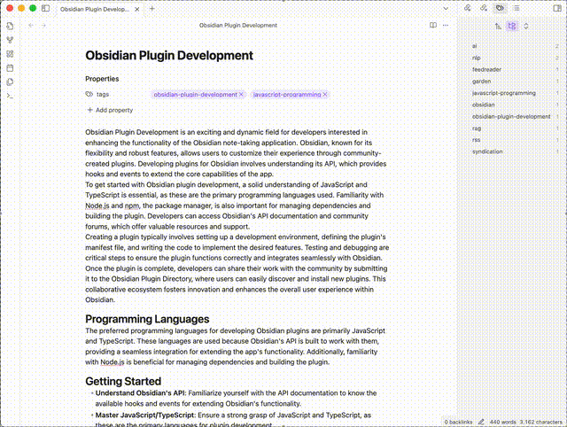

# Obsidian Insight Engine Plugin

[](LICENSE)
[](https://github.com/username/obsidian-insight-engine/releases)
[]()

Transform your Obsidian vault into an AI-powered knowledge base while keeping your privacy intact. The Insight Engine plugin enhances your note-taking experience by leveraging privacy-focused local processing with Ollama.

<p align="center">
  
</p>

If you find this plugin helpful in organizing and enhancing your knowledge base, consider buying me a coffee! Your support helps me maintain and improve the plugin with new features and regular updates. Every coffee fuels the development of better tools for the Obsidian community! 🚀☕️

[](https://www.buymeacoffee.com/vodaza36)

## ✨ Key Features

<p align="center">
  
</p>

### 🏷️ Intelligent Tag Generation

- Scans individual notes to generate contextually relevant tags
- Considers existing tags in your vault for consistency
- Suggests new tags when existing ones don't fit the content

### 📝 Note Summarization

- Generates concise summaries of your notes
- Supports Markdown formatting in summaries
- Provides easy one-click copy to clipboard functionality

### ❓ Question Generation

- Extracts key questions from your note content
- Presents questions formatted in Markdown for better readability
- Offers quick copy-to-clipboard feature for generated questions

### 🔒 Privacy-First Architecture

- Utilizes Ollama for local LLM processing
- Keep all your data secure and private
- Full control over your note analysis

## 🚀 Installation

### Community Plugin Store (Recommended)

1. Open Obsidian Settings
2. Go to Community Plugins and disable Safe Mode
3. Click Browse and search for "Insight Engine"
4. Install the plugin and enable it

### Manual Installation

1. Download the latest release from the [releases page](https://github.com/username/obsidian-insight-engine/releases)
2. Extract the ZIP file into your vault's `.obsidian/plugins` folder
3. Reload Obsidian
4. Enable the plugin in Community Plugins settings

## ⚙️ Setup

### Ollama Setup

1. Install Ollama from [ollama.ai](https://ollama.ai)
2. Pull your preferred model: `ollama pull llama2`
3. Start Ollama
4. In plugin settings:
    - Set Host URL (default: http://localhost:11434)
    - Choose your model (default: llama2)

## 📖 Usage

### Basic Commands

- `Cmd/Ctrl + P` → "Generate Tags" to analyze current note
- Configure tag style and location in settings
- Tags can be added as YAML frontmatter or inline

## 🛠️ Development

### Prerequisites

- Node.js 16+
- npm or yarn
- Git

### Setup Development Environment

1. Clone the repository

```bash
git clone https://github.com/username/obsidian-insight-engine.git
cd obsidian-insight-engine
```

2. Install dependencies

```bash
npm install
```

3. Build for development

```bash
npm run dev
```

4. For production build

```bash
npm run build
```

### Testing

- Run all tests: `npm test`
- Watch mode: `npm run test:watch`
- E2E tests: `npm run test:e2e`

### Creating a Release

1. Update version numbers in:

    - `manifest.json`
    - `package.json`

2. Create the release:

```bash
npm run create-release
```

This will:

- Build the project
- Create release assets (`main.js`, `manifest.json`, `styles.css`)
- Create a GitHub release with the version tag
- Upload all assets to the release

The release will be available at: `https://github.com/username/obsidian-insight-engine/releases`

## 📄 License

This project is licensed under the MIT License - see the [LICENSE](LICENSE) file for details.

---

### ❤️ Support the Development

If you're enjoying the Insight Engine plugin and want to support its continued development, consider buying me a coffee! Your support means the world and helps keep this project growing with new features and improvements.

[](https://www.buymeacoffee.com/vodaza36)
