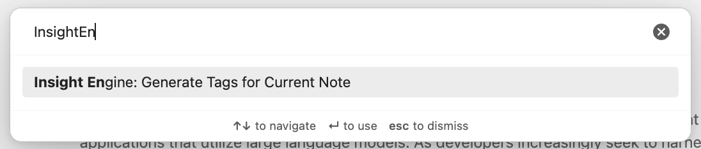

# Obsidian Insight Engine Plugin

Transform your Obsidian vault with AI-powered insights while keeping your privacy intact. The Insight Engine plugin enhances your note-taking experience by combining the power of advanced AI with the flexibility to choose between cloud-based (OpenAI) or privacy-focused local (Ollama) processing.

## ✨ Key Features

### 🤖 Intelligent Tag Generation
- Automatically generates contextually relevant tags based on note content
- Understands relationships between notes for smarter tagging
- Suggests tags that reflect both explicit and implicit themes in your content

### 🔒 Privacy-First Architecture
- Choose between OpenAI (cloud) or Ollama (local) for AI processing
- Keep sensitive notes private with local processing
- Full control over your data and AI model selection

### 🎯 Coming Soon
- AI-powered semantic search across your vault
- Natural language querying for intuitive note discovery
- Enhanced context understanding for more accurate results

## 🚀 Quick Start

1. Install the plugin from Obsidian's Community Plugins
2. Choose your preferred AI backend:
   - OpenAI for cloud processing
   - Ollama for local, private processing
3. Start generating intelligent tags with a single command!

## ⚙️ Setup

### OpenAI Setup
1. Get your API key from [OpenAI](https://platform.openai.com/)
2. Open Settings → Insight Engine
3. Paste your API key
4. Configure model preferences

### Ollama Setup (Privacy-Focused Option)
1. Install Ollama from [ollama.ai](https://ollama.ai)
2. Pull your preferred model
3. Select Ollama in plugin settings
4. Start using AI features completely offline!

## 📖 Usage

### Basic Commands
- `Cmd/Ctrl + P` → "Generate Tags" to analyze current note
- More commands coming soon!

### Example Workflow
1. Write your note
2. Run tag generation
3. Review and apply suggested tags
4. Enjoy enhanced note organization!

## 🛠️ Technical Requirements

- Obsidian v1.0.0+
- For Ollama: Local installation
- For OpenAI: API key and internet connection

## 🤝 Contributing

We welcome contributions! Check out our [CONTRIBUTING.md](CONTRIBUTING.md) for guidelines.

## 📝 License

MIT License - see [LICENSE](LICENSE) for details.

### Third-Party Licenses

This project uses several open-source packages:

- LangChain packages (@langchain/core, @langchain/ollama, @langchain/openai) - Apache-2.0 License
- tslib - BSD-3-Clause License
- Various development tools under MIT and Apache-2.0 licenses

For full license texts, please see the respective packages' repositories.

## 🆘 Support

- [Report Issues](https://github.com/username/obsidian-insight-engine/issues)
- [Join Discussions](https://github.com/username/obsidian-insight-engine/discussions)

## 📜 Changelog

See [CHANGELOG.md](CHANGELOG.md) for version history.

## ⚠️ Disclaimer

Please note that this plugin is provided "as is" without warranty of any kind. For more details about limitations of liability and user responsibilities, see our [DISCLAIMER.md](DISCLAIMER.md).
