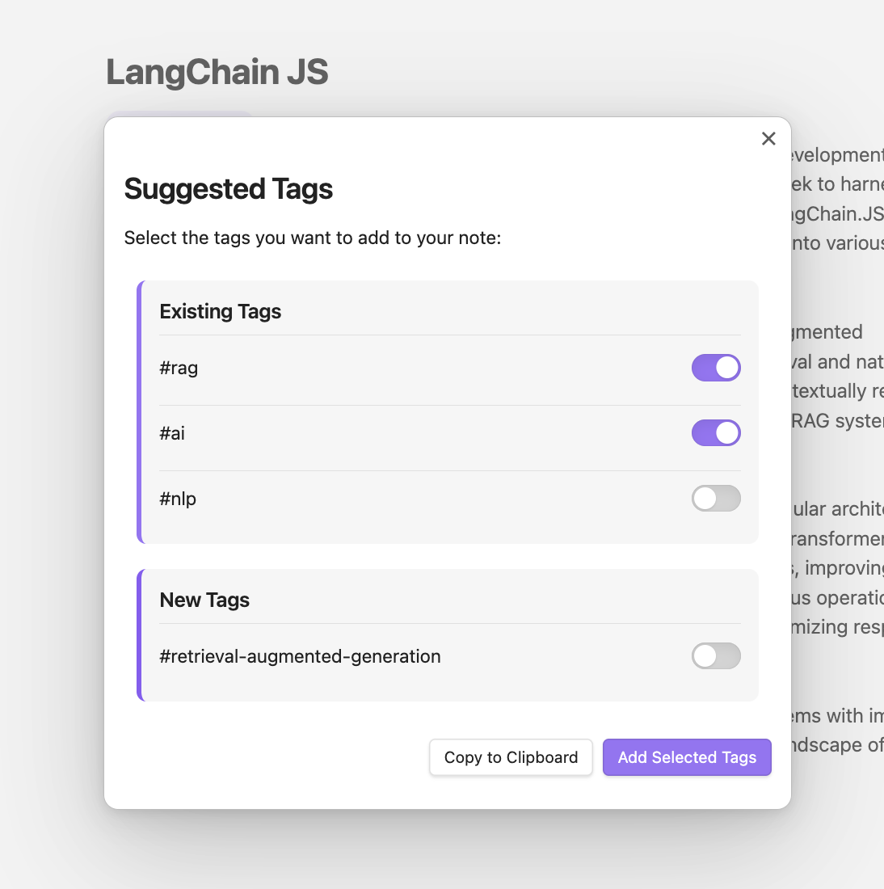

# Obsidian Insight Engine Plugin

An intelligent search and insight engine plugin for Obsidian that enhances your note-taking experience with AI-powered capabilities using OpenAI or Ollama.

## Features
- Automatic tag generation based on associated notes

### Roadmap
- AI-powered semantic search across your vault
- Natural language processing for better search results
- Support for both OpenAI and Ollama as AI backends

## Installation

1. Open Obsidian and go to Settings
2. Navigate to Community Plugins and disable Safe Mode
3. Click on Browse and search for "Insight Engine"
4. Click Install
5. Enable the plugin in your Community Plugins list

### Manual Installation

1. Download the latest release from the releases page
2. Extract the zip file into your `.obsidian/plugins` folder
3. Reload Obsidian
4. Enable the plugin in your Community Plugins list

## Configuration

### OpenAI Setup

1. Obtain an API key from [OpenAI](https://platform.openai.com/)
2. In Obsidian, go to Settings → Insight Engine
3. Enter your OpenAI API key
4. Configure the model and parameters as needed

### Ollama Setup

1. Install Ollama from [ollama.ai](https://ollama.ai)
2. Pull your desired model using the Ollama CLI
3. In Obsidian, go to Settings → Insight Engine
4. Select Ollama as your AI provider
5. Configure the model and endpoint settings

## Usage

### Basic Search
1. Open the Command Palette (Cmd/Ctrl + P)
2. Type "Insight Engine"
3. Execute the command you like, e.g. "Generat Tags"

## Dependencies

- Obsidian v1.0.0 or higher
- Node.js v16 or higher (for development)
- OpenAI API key or Ollama installation

## Contributing

We welcome contributions! Please see our [CONTRIBUTING.md](CONTRIBUTING.md) for guidelines.

## Security

For security concerns, please refer to our [SECURITY.md](SECURITY.md) file.

## License

This project is licensed under the MIT License - see the [LICENSE](LICENSE) file for details.

## Changelog

See [CHANGELOG.md](CHANGELOG.md) for a list of changes and version history.

## Support

- [GitHub Issues](https://github.com/username/obsidian-insight-engine/issues)
- [Project Discussions](https://github.com/username/obsidian-insight-engine/discussions)

## Acknowledgments

- Obsidian team for their amazing platform
- OpenAI and Ollama for their AI capabilities
- All contributors and users of this plugin
